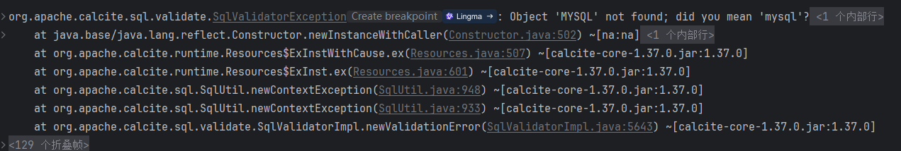

# calcite 测试demo

## 数据库表情况

### Mysql 8表结构                               

|     Type     | Field     |
|:------------:|-----------|
|     int      | id        |
| varchar(100) | user_name |
|     int      | age       |
|  varchar(1)  | sex       |

### PostgresSQL表结构
|     Type     | Field      |
|:------------:|------------|
| varchar(100) | user_name  |
|     int      | user_level |

## 功能测试

- [x] 测试数据库连接切换到calcite  单个数据库查询 无mybatis-plus框架
- [x] 测试数据库连接切换到calcite  多个数据库联合查询 无mybatis-plus框架与mybatis-plus框架均可
- [x] 测试数据库连接切换到calcite  calcite建立数据库视图  联合mybatis-plus查询  
- [ ] 测试calcite翻译sql能力  

## 存在的问题
- [x] HikariDataSource在初始化后直接占满数据库连接   
> 解决方案（临时）:可以设置池大小 setMinimumIdle(1)
- [x] 在查model文件中配置好的view时 出现莫名的大写MYSQL view无法创建成功  

> 解决方案: calcite在查询时类似Oracle 将所有数据改为大写 加双引号强制转为小写
> 
> 
> view初始化时机    在calcite创建连接时创建view
> 框架使用  可以
> 多个数据库的识别问题   使用数据库唯一id
> 
> 数据库枚举类型映射出会出现空格
> Date类型会出现小时分钟等
> datetime无法识别
> pg的json类无法识别

